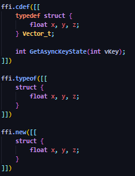
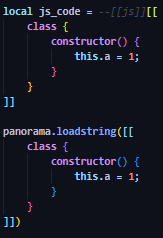

# 🎨 Lua C/JS Highlight for VS Code

**Lua C/JS Highlight** is a powerful syntax injection extension for Visual Studio Code. It brings native-level syntax highlighting to **C** and **JavaScript** snippets embedded directly inside Lua files.

Perfect for developers working with:
* **LuaJIT FFI** (Game hacking, high-performance computing)
* **Source Engine Panorama UI** (CS2, Dota 2 modding)

---

## ✨ Key Features

* 🔍 **Auto-Detection**: Recognizes `ffi.cdef`, `ffi.typeof`, `ffi.new`, and `panorama.loadstring` automatically.
* 🛠️ **Manual Tags**: Force highlighting for any block using `--[[c]]` or `--[[js]]` comments.
* 📦 **Zero Config**: Works out of the box with standard Lua grammars.
* 🚀 **Performance**: Lightweight injection that doesn't slow down your editor.

---

## 🚀 Usage & Examples

### 🔹 C / C++ (FFI)
Designed specifically for **LuaJIT FFI** users. It handles complex structs and function definitions seamlessly.

### 🔹 JavaScript (Panorama)

